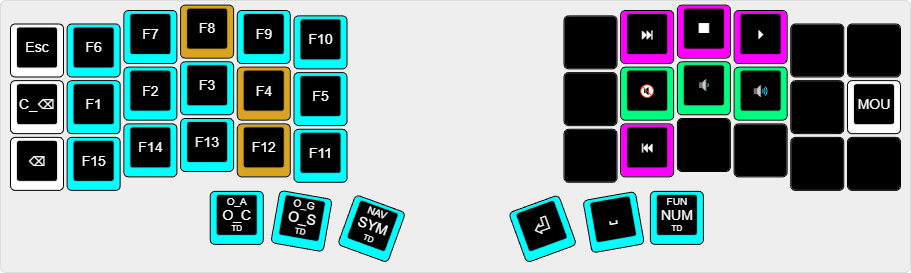

#### Default layer

#### **SYM**: Symbol layer

#### **NUM**: Number layer

#### **NUNA**: Number's navigation layer (only reachable via **NUM* layer)

#### **NAV**: Navigation layer

#### **FUN**: Function & media layer

#### **MOU**: Mouse layer

#### **MNG**: Management layer

