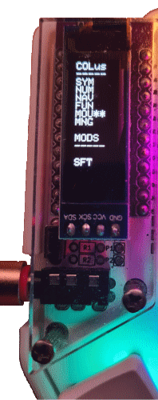

---
## Intro
Custom keyboard firmware for Corne 42 using **QMK** (Quantum Mechanical Keyboard) firmware.\
<https://docs.qmk.fm/#/>

### Key features
* Two different default layout with support for two different OS keyboard languages:
    * US QWERTY keyboard language:
        * Colemak-DH US key layout (`COLus`)
        * QWERTY US key layout (`QWEus`)
    * Swedish QWERTY keyboard language:
        * Colemak-DH US key layout (`COLen`)
        * Colemak-DH Swedish key layout (`COLse`)
        * QWERTY US key layout (`QWEen`)
        * QWERTY Swedish key layout (`QWEse`)
* Custom language keycodes.
* OLED display that shows the current default layout along with active layers and mods.
* RGB-lightning based on the active layer.

### Hardware used
| Part            | Component                                |
|:----------------|:-----------------------------------------|
| Board           | Corne 42                                 |
| Microcontroller | Elite-C (with USB-C port)                |
| OLED display    | 128x32                                   |
| Switches        | Kailh Choc Red                           |
| O-rings         | Cherry MX Translucent - 40A Thin (1.5mm) |

### How to build and flash firmware
1. Install QMK tools:
    * QMK\_MSYS.exe <https://docs.qmk.fm/#/newbs_getting_started>
    * QMK Toolbox <https://docs.qmk.fm/#/newbs_flashing>
2. Setup QMK firmware directory with QMK\_MSYS
    1. Create a `qmk_firmware` directory where you want the QMK files to be placed.
    2. `$> qmk config user.qmk_home=<QMK_FIRMWARE_DIRECTORY>`\
       where `QMK_FIRMWARE_DIRETORY` is the path to the `qmk_firmware` directory.
    3. `$> qmk setup`\
       this will clone the qmk\_firmware repository and it's submodules. It will set
       the QMK repository <https://github.com/qmk/qmk_firmware> as an upstream repository.
    4. If needed downgrade `avr-gcc` since later version can produce firmware that is to big.\
       To downgrade to 8.5.0\
       `$> pacman -U https://mirror.msys2.org/mingw/mingw64/mingw-w64-x86_64-avr-gcc-8.5.0-1-any.pkg.tar.zst`
3. Copy `saidout_qmk_crkbd_rev1` to folder `qmk_firmware\keyboards\crkbd\keymaps`
4. `$> qmk compile -kb crkbd/rev1 -km saidout_qmk_crkbd_rev1`\
   This will compile the firmware.
5. Run QMK Toolbox
    * Set `MCU (AVR only}` to `ATmega32U4`
    * Set `Local file` to the compiled firmware `crkbd_rev1_saidout_qmk_crkbd_rev1.hex` file.
    * Flash the firmware to the keyboard.

> [!NOTE]\
> The code has been compiled with `avr-gcc.exe (GCC) 8.5.0` and `qmk_firmware (master)` commit
> `b7468f47857ad20a031906ccbd654541222a0d26`.

### Source code organization
* `caps_word_split`: Sync the Caps Word status from master to slave.
* `config.h`: QMK related configuration.
* `custom_keycode_ranges.h`: Define ranges for custom keys.
* `dfc_keys`: Custom keys that sets the default layout and language.
* `keymap.c`: QMK main file for defining layers and processing of key events.
* `language_keys`: Custom keys to handle translation of keycodes for different OS keyboard languages.
* `layer_names.h`: Definition of all the layers used.
* `oled.c`: Display status of the layers and mod keys.
* `process_tap_dance_adv`: Tap dance that can handle toggling of layer, one shot layer and one shot keys.
* `rgb_layer`: Control the RGB color lightning for each layer.
* `rules.mk`: QMK compiler configuration.


---
## Custom keycodes for setting the default layout & OS keyboard language
Default layout is controlled by custom keycodes that both sets the layout and language.

|  Keycode  | Keyboard layout | OS keyboard language |  OLED   |
|:---------:|:----------------|:--------------------:|:-------:|
| `DFC_CUS` | Colemak-DH US   |          US          | `COLus` |
| `DFC_CSE` | Colemak-DH SE   |          SE          | `COLse` |
| `DFC_CEN` | Colemak-DH US   |          SE          | `COLen` |
| `DFC_QUS` | QWERTY US       |          US          | `QWEus` |
| `DFC_QSE` | QWERTY SE       |          SE          | `QWEse` |
| `DFC_QEN` | QWERTY US       |          SE          | `QWEen` |

One additional key:
* `DFC_LAY`: Switch layout, i.e. between US and SE only applicable when OS keyboard language is SE.

Transitions for DFC\_LAY key

| Active Default layer | DFC\_LAY |
|:--------------------:|:--------:|
|       `COLus`        | `-----`  |
|       `COLse`        | `COLen`  |
|       `COLen`        | `COLse`  |
|       `QWEus`        | `-----`  |
|       `QWEse`        | `QWEen`  |
|       `QWEen`        | `QWEse`  |

### Implementation
The processing of the custom default layout keycodes are done in\
`bool process_default_layer_keycodes(uint16_t keycode, keyrecord_t *record)`\
which is called from the QMK function\
`bool process_record_user(uint16_t keycode, keyrecord_t *record)`\
that is implemented in `keymap.c`.

When processing custom default layout keycodes the `current_lang` variable in `language_keys.h` may be updated.


---
## Custom language keycodes
The keyboard can be used with two different OS keyboard language layouts:
* QWERTY US layout
* QWERTY Swedish layout

To be able to have the same layout for keys that have different keycodes for the different
OS keyboard language layouts custom language keycodes has been created.

List of language keycodes and the corresponding keycode they translate to for the different OS keyboard language
layouts.

|      Key      | Language keycode | US keycode | Swedish keycode |
|:-------------:|:-----------------|:-----------|:----------------|
|      `'`      | `LL_QUOT`        | `KC_QUOT`  | `SE_QUOT`       |
|      `"`      | `LL_DQUO`        | `KC_DQUO`  | `SE_DQUO`       |
|    `'` `ä`    | `LL_QUAD`        | `KC_QUOT`  | `SE_ADIA`       |
| `TG_MOUS` `ä` | `LL_MOAD`        | `TG_MOUS`  | `SE_ADIA`       |
| `TG_MOUS` `'` | `LL_MOQU`        | `TG_MOUS`  | `SE_QUOT`       |
|   `TG_MOUS`   | `LL_MOMO`        | `TG_MOUS`  | `TG_MOUS`       |
| `CW_TOGG` `ö` | `LL_WTOD`        | `CW_TOGG`  | `SE_ODIA`       |
|   `CW_TOGG`   | `LL_WTWT`        | `CW_TOGG`  | `CW_TOGG`       |
|    `/` `å`    | `LL_SLAR`        | `KC_SLSH`  | `SE_ARNG`       |
|      `;`      | `LL_SCLN`        | `KC_SCLN`  | `SE_SCLN`       |
|      `~`      | `LL_TILD`        | `KC_TILD`  | `SE_TILD`       |
|      `*`      | `LL_ASTR`        | `KC_ASTR`  | `SE_ASTR`       |
|      `:`      | `LL_COLN`        | `KC_COLN`  | `SE_COLN`       |
|      `{`      | `LL_LCBR`        | `KC_LCBR`  | `SE_LCBR`       |
|      `}`      | `LL_RCBR`        | `KC_RCBR`  | `SE_RCBR`       |
|      `[`      | `LL_LBRC`        | `KC_LBRC`  | `SE_LBRC`       |
|      `]`      | `LL_RBRC`        | `KC_RBRC`  | `SE_RBRC`       |
|      `<`      | `LL_LABK`        | `KC_LABK`  | `SE_LABK`       |
|      `>`      | `LL_RABK`        | `KC_RABK`  | `SE_RABK`       |
|      `(`      | `LL_LPRN`        | `KC_LPRN`  | `SE_LPRN`       |
|      `)`      | `LL_RPRN`        | `KC_RPRN`  | `SE_RPRN`       |
|      `/`      | `LL_SLSH`        | `KC_SLSH`  | `SE_SLSH`       |
|      `\`      | `LL_BSLS`        | `KC_BSLS`  | `SE_BSLS`       |
|      `_`      | `LL_UNDS`        | `KC_UNDS`  | `SE_UNDS`       |
|      `-`      | `LL_MINS`        | `KC_MINS`  | `SE_MINS`       |
|      `+`      | `LL_PLUS`        | `KC_PLUS`  | `SE_PLUS`       |
|      `=`      | `LL_EQL`         | `KC_EQL`   | `SE_EQL`        |
|      `%`      | `LL_PERC`        | `KC_PERC`  | `SE_PERC`       |
|      `´`      | `LL_ACUT`        | `XXXXXXX`  | `SE_ACUT`       |
|    `` ` ``    | `LL_GRV`         | `KC_GRV`   | `SE_GRV`        |
|      `$`      | `LL_DLR`         | `KC_DLR`   | `SE_DLR`        |
|      `&`      | `LL_AMPR`        | `KC_AMPR`  | `SE_AMPR`       |
|      `?`      | `LL_QUES`        | `KC_QUES`  | `SE_QUES`       |
|     `\|`      | `LL_PIPE`        | `KC_PIPE`  | `SE_PIPE`       |
|      `!`      | `LL_EXLM`        | `KC_EXLM`  | `SE_EXLM`       |
|      `@`      | `LL_AT`          | `KC_AT`    | `SE_AT`         |
|      `#`      | `LL_HASH`        | `KC_HASH`  | `SE_HASH`       |
|      `^`      | `LL_CIRC`        | `KC_CIRC`  | `SE_CIRC`       |
|      `§`      | `LL_SECT`        | `XXXXXXX`  | `SE_SECT`       |
|      `¨`      | `LL_DIAE`        | `XXXXXXX`  | `SE_DIAE`       |
|      `½`      | `LL_HALF`        | `XXXXXXX`  | `SE_HALF`       |
|      `¤`      | `LL_CURR`        | `XXXXXXX`  | `SE_CURR`       |
|      `£`      | `LL_PND`         | `XXXXXXX`  | `SE_PND`        |
|      `€`      | `LL_EURO`        | `XXXXXXX`  | `SE_EURO`       |
|      `µ`      | `LL_MICR`        | `XXXXXXX`  | `SE_MICR`       |

### Implementation
The OS keyboard language is stored in the variable `current_lang` defined in `language_keys.h` and is set by
the custom keycodes used to set *default layout* that are defined in `dfc_keys.h`.

For split keyboard the `current_lang` is sent from master to slave.\
See [Split keboard -- sending data from master to slave](#split-keyboard---sending-data-from-master-to-slave)
for details on how `current_lang` is sent from master to slave.

The processing of the custom language keycodes are done in\
`bool process_lang_keycodes(uint16_t keycode, keyrecord_t *record)`\
which is called from the QMK function\
`bool process_record_user(uint16_t keycode, keyrecord_t *record)`\
that is implemented in `keymap.c`.

### Language tap dance support
Language keys can be used in tap dance and it can be setup using the macro\
`ACTION_TAP_DANCE_LANG(kc1, kc2)`

> [!NOTE]\
> The language tap dance support the following keycodes:
> * Language keycodes
> * Basic keycodes
> * Toggling layers (`QK_TOGGLE_LAYER ... QK_TOGGLE_LAYER_MAX`)
> * Caps Word (`CW_TOGG`)
>
> To add tap dance support for other keycodes then modify the functions
> * `tap_dance_lang_register_kc`
> * `tap_dance_lang_process`
>
> in `language_keys.c`


---
## OLED display
The OLED display is used to display the following information:
* Default layout
* Layer status
* Caps word
* Mod keys status

The OLED display has 15 rows x 5 columns

| Row |                 Possible values                 | Comment                                                                 |
|----:|:-----------------------------------------------:|:------------------------------------------------------------------------|
|   1 | `COLus` `COLse` `COLen` `QWEus` `QWEse` `QWEen` | Default layer that is active.                                           |
|   2 |                     `-----`                     | Horizontal separator.                                                   |
|   3 |                `SYM  `   `SYM**`                | Indicates if *Symbol* layer is active.                                  |
|   4 |            `NUM  `  `NUM**`  `NUMn*`            | Indicates if *Number* layer is active or *Number's navigation* layer.   |
|   5 |                `NAV  `   `NAV**`                | Indicates if *Navigation* layer is active.                              |
|   6 |                `FUN  `   `FUN**`                | Indicates if *Function & media* layer is active.                        |
|   7 |                `MOU  `   `MOU**`                | Indicates if *Mouse* layer is active.                                   |
|   8 |                `MNG  `   `MNG**`                | Indicates if *Management* layer is active.                              |
|   9 |                                                 | Row is empty.                                                           |
|  10 |                     `MODS `                     | Fixed header.                                                           |
|  11 |                     `-----`                     | Horizontal separator.                                                   |
|  12 |                `     `   `CW   `                | If caps word is active then CW is displayed.                            |
|  13 |            `     `  `OSFT `  `SFT  `            | **OSFT**: one shot *Left Shift*, **SFT**: *Left Shift* is active.       |
|  14 |            `     `  `OCTRL`  `CTRL `            | **OCTRL**: one shot *Left Control*. **CTRL**: *Left Control* is active. |
|  15 |            `     `  `OALT `  `ALT  `            | **OALT**: one shot *Left Alt*. **ALT**: *Left Alt* is active.           |
|  16 |            `     `  `OGUI `  `GUI  `            | **OGUI**: one shot *Left GUI* active. **GUI**: *Left GUI* is active.    |

> [!NOTE]\
> If layer has two stars behind it's active.



### Implementation
The OLED display is updated by the QMK function\
`bool oled_task_user(void)`\
which is implemented in `oled.c`.

Updating the OLED buffer is done by calling\
`void oled_write_P(const char *data, bool invert)`\
for each row where data is set to 5 characters.

For the split slave side to display the correct information it needs to know:
* Layer status
* Current language
* Caps word status
* Mod status

See [Split keyboard - sending data from master to slave](#split-keyboard---sending-data-from-master-to-slave)
for how this information is being sent from split master to slave.

### Configuration
To turn on OLED support in QMK do the following
* in `rules.mk` add
```
OLED_ENABLE  = yes
OLED_DRIVER  = ssd1306
```
* in `config.h` add
```
#ifdef OLED_ENABLE
#    define OLED_DISPLAY_128X32
#    define SPLIT_OLED_ENABLE
#    define OLED_TIMEOUT         OLED_RBG_TIMEOUT
#endif // OLED_ENABLE
```

The `#define OLED_TIMEOUT         OLED_RBG_TIMEOUT` will turn off the OLED display if no keys
have been pressed during the timeout period in order to prevent OLED burn-in.\
The `OLED_RBG_TIMEOUT` is used to make sure that both the OLED display and RGB has the same timeout.


---
## Process tap dance advance
The QMK tap dance was missing some features:
* Layer
    * Ability to toggle layer on any of the two tap dance keys.
    * For one shot layer if the key is held to instead turn on the layer and to turn off it when the key is released.
* Modifiers
    * Ability to have one shot modifiers on any of the two tap dance keys.
    * To toggle on/off one shot modifiers if the same key is tapped.
    * For one shot modifiers if the key is held to instead have the modifier active.


This features are provided in the\
`process_tap_dance_adv.h`\
and can be setup using the macro\
`ACTION_TAP_DANCE_ADV_KEY(kc1, kc2)`

Example having two one shot modifier for example:\
`ACTION_TAP_DANCE_ADV_KEY(MOD_LALT, MOD_LGUI)`\
would have the following behavior

| Key action | Effect                        |
|:----------:|:------------------------------|
|    tap     | one shot *Left Alt* modifier. |
|    hold    | *Left Alt* modifier active.   |
|  tap tap   | one shot *Left GUI* modifier. |
|  tap hold  | *Left GUI* modifier active.   |


---
## RGB layer
Each layer can have it's own RGB lighting layout. The RGB lighting layout is stored in the `rgb_layer_colors`
(defined in `rgb_layer.h`).\
The `rgb_layer_colors_index` contains an index for each layer to it's corresponding RGB lighting layout that is
stored in `rgb_layer_colors` (defined in `rgb_layer.h`).\
The reason that a layer index is used is that 4 layers have all RGB colors turned off and to save firmware
space they don't have any color layer defined in `rbg_layer_colors` and there index is set to
`RGB_LAYER_ALL_COLORS_OFF` which indicates that all RBG lights should be set to black.

> [!NOTE]\
> This saves 576 bytes minus some overhead code for handling layer indexing into the defined colors.\
> $4(3*48) = 576_{bytes}$\
> Formula $L(C*RC)$ where $C$ is bytes required for each color, $RC$ is the row and column defined for the keyboard
> and $L$ is number of layers. Corne 42 defines 8 rows and 6 columns meaning that each layer will contain 6 values
> that are never used.

There are three custom keycodes that can be used to turn on and off the rgb layer.

| Keycode   | Effect                    |
|:----------|:--------------------------|
| `RLC_ON`  | Turn on rgb layer light.  |
| `RLC_OFF` | Turn off rgb layer light. |
| `RLC_TG`  | Toggles rgb layer light.  |

RGB functions

| Function                      | Effect                           |
|:------------------------------|:---------------------------------|
| `bool rgb_layer_is_on(void)`  | `true` if rgb layer light is on. |
| `void rgb_layer_on(void)`     | Turn on rgb layer light.         |
| `void rgb_layer_off(void)`    | Turn off rgb layer light.        |
| `void rgb_layer_toggle(void)` | Toggles rgb layer light.         |

### Implementation
In `keymap.c` the color layouts are assigned the `rgb_layer_colors` variable using the macro\
`COLOR_split_3x6_3` (defined in `rgb_layer.h`)\
which make it easy to set the RGB lightning layout for a layer.\
Then for each layer their corresponding index into the `rgb_layer_colors` variable is set
in `rgb_layer_colors_index`. For layers that does not have any colors defined in `rgb_layer_colors`
there index is set to `RGB_LAYER_ALL_COLORS_OFF`.

The RGB layer need to be setup by calling the\
`void rgb_layer_setup(void)`\
from the QMK function\
`void keyboard_post_init_user(void)`\
in `keymap.c`

The processing of the custom RGB keycodes are done in\
`bool process_rgb_keycodes(uint16_t keycode, keyrecord_t *record)`\
which is called from the QMK function\
`bool process_record_user(uint16_t keycode, keyrecord_t *record)`\
that is implemented in `keymap.c`.

The QMK function\
`bool rgb_matrix_indicators_user(void)`\
is called to set RGB colors and it's implementation in `rgb_layer.c`.\
The implementation sets the RBG color for each key based on the active layer.

### Configuration
To turn on RGB matrix support in QMK do the following
* in `rules.mk` add
```
RGBLIGHT_ENABLE   = no
RGB_MATRIX_ENABLE = yes
```
* in `config.h` add
```
#ifdef RGB_MATRIX_ENABLE
#    define RGB_MATRIX_TIMEOUT   OLED_RBG_TIMEOUT
#endif // RGB_MATRIX_ENABLE
```

The `#define RGB_MATRIX_TIMEOUT   OLED_RBG_TIMEOUT` will turn off the RGB if no keys have been pressed
during the timeout period.\
The `OLED_RBG_TIMEOUT` is used to make sure that both the OLED display and RGB has the same timeout.


---
## Split keyboard - sending data from master to slave
For the OLED display to show correct information on the slave the following information must be sent from
the split master to the slave:
* Layer status
* Current language
* Caps word status
* Mod status

The layer status and mod status is sent from master to slave by adding the following to `config.h`:
```
#define SPLIT_LAYER_STATE_ENABLE
#define SPLIT_MODS_ENABLE
```

For current language and caps word status custom code is needed.

### Custom code for sending message from master to slave
For sending code from master to slave you need:
1. Define the message id. This is done with the QMK macro `SPLIT_TRANSACTION_IDS_USER`.
2. Register the slave callback handler with QMK function `transaction_register_rpc`.
3. Sending message from master to slave with QMK function `transaction_rpc_exec`.

#### Defining message id
In `config.h` message id for current language and caps word is registered by adding:\
`#define SPLIT_TRANSACTION_IDS_USER PUT_CURRENT_LANG, PUT_CAPS_WORD`

> [!NOTE]\
> That the `SPLIT_TRANSACTION_IDS_USER` is expanded in QMK file `transaction_id_define.h` adding
> `PUT_CURRENT_LANG` and `PUT_CAPS_WORD` as enum value to `enum serial_transaction_id`.

#### Register the slave callback handler
The slave callbacks are registered by calling the functions:
* `caps_word_register_slave_handler` defined in `caps_word_split.h`
* `current_lang_register_slave_handler` defined in `language_keys.h`

from QMK function `void keyboard_post_init_user(void)` in `keymap.c`.

#### Sending message from master to slave
Both functions
* `caps_word_sync_if_changed` defined in `caps_word_split.h`.
* `current_lang_sync_if_changed` defined in `language_keys.h`.

will send message from master to slave if the value has changed since the last message was sent.

They should be called regular which in done from the QMK function\
`void housekeeping_task_user(void)`\
in `keymap.c`.


---
## Layers

Layout images markers:
* **LL**: indicates that the key is associated with a language keycode.
* **LD**: indicates language tap dance where top indicates single tap key and the bottom double tap key.
* **TD**: indicates advanced tap dance where the larger text indicates single tap key and the smaller double tap key.
* **DFC**: indicates default language keycode.
* **RGB**: indicates RGB layout keycode.

### Keys


| Action     | Effect                          |
|------------|---------------------------------|
| One tap    | *Left Shift* one shot modifier. |
| Hold       | *Left Shift* modifier active.   |
| Two tap    | *Left GUI* one shot modifier.   |
| Tap & hold | *Left GUI* modifier active.     |


| Action     | Effect                            |
|------------|-----------------------------------|
| One tap    | *Left control* one shot modifier. |
| Hold       | *Left control* modifier active.   |
| Two tap    | *Left Alt* one shot modifier.     |
| Tap & hold | *Left Alt* modifier active.       |


| Action     | Effect                        |
|------------|-------------------------------|
| One tap    | **Symbol** one shot layer.    |
| Hold       | **Symbol** layer is active    |
| Two tap    | Toggles **Navigation** layer. |


| Action     | Effect                              |
|------------|-------------------------------------|
| One tap    | Toggles **Number** layer.           |
| Two tap    | Toggles **Function & media** layer. |


### Default layer


### **SYM**: Symbol layer


### **NUM**: Number layer


### **NUNA**: Number's navigation layer

> [!NOTE]
> Only reachable via **NUM** layer

###  **NAV**: Navigation layer


### **FUN**: Function & media layer


### **MOU**: Mouse layer


### **MNG**: Management layer


---
## Keyboard layout images
Keyboard image layouts was created using\
<http://www.keyboard-layout-editor.com/>

Each keyboard layer image was based on a custom Corne 42 blank layout.

**Raw data** for the custom Corne 42 blank layout.
```
[{y:0.25},"",{x:0.05},"",{x:0.05,y:-0.25},"",{x:0.05,y:-0.1},"",{x:0.05,y:0.1},"",{x:0.05,y:0.1},"",{x:4},"",{x:0.05,y:-0.1},"",{x:0.05,y:-0.1},"",{x:0.05,y:0.1},"",{x:0.05,y:0.25},"",{x:0.05},""],
[{y:0.05},"",{x:0.05},"",{x:0.05,y:-0.25},"",{x:0.05,y:-0.1},"",{x:0.05,y:0.1},"",{x:0.05,y:0.1},"",{x:4},"",{x:0.05,y:-0.1},"",{x:0.05,y:-0.1},"",{x:0.05,y:0.1},"",{x:0.05,y:0.25},"",{x:0.05},""],
[{y:0.05},"",{x:0.05},"",{x:0.05,y:-0.25},"",{x:0.05,y:-0.1},"",{x:0.05,y:0.1},"",{x:0.05,y:0.1},"",{x:4},"",{x:0.05,y:-0.1},"",{x:0.05,y:-0.1},"",{x:0.05,y:0.1},"",{x:0.05,y:0.25},"",{x:0.05},""],
[{x:3.7,y:0},""],
[{r:10,rx:0.9,ry:-0.8,y:3.35,x:4.75},""],
[{r:20,rx:1.9,ry:-1.8,y:3.35,x:6},""],
[{r:0, x:9.95,y:0.8},""],
[{r:-10,rx:2,ry:6.05,x:8.9,y:-1},""],
[{r:-20,rx:-0.85,ry:3.85,x:9.5,y:3.35},""]
```

Each keyboard layout data can be found under `documentation/<LAYER_NAME>_layer.json`.\
The `corne42_keyboard_layout.json` contain a blank keyboard layout that can be used to create new keyboard
layouts for a 42 split keyboard.
